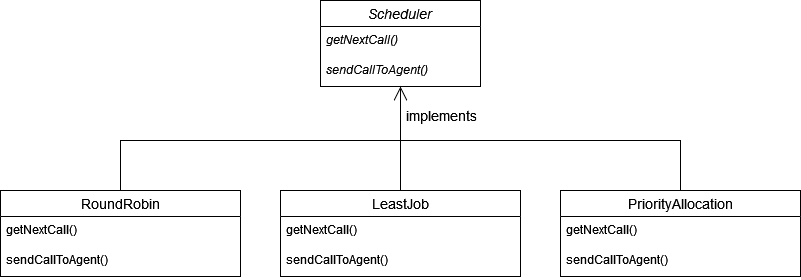

## 인터페이스를 활용한 정책 프로그래밍
> 콜 센테에 전화 상담을 하는 상담원들이 있다. 일단 고객에게서 전화가 오면 대기열에 저장되고 각 상당원에게 배분된다.
### 배분이 되는 정책은 크게 세 가지
- 모든 상담원이 동일한 상담 건수를 처리하도록 상담원에게 순서대로 배분.
- 쉬고 있거나 상담원에게 할당된 통화 수가 가장 작은 상담원에게 배분.
- 고객의 등급에 따라 등급이 높은 고객은 업무능력이 우수한 상담원에게 배분.

